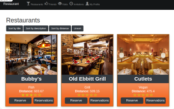

# Restaurant App

<!-- PROJECT LOGO -->
<div align="center">
  <a href="https://github.com/VuDej/restaurants-app">
    
  </a>

  <h1 align="center">.Restaurant App</h1>

  <p align="center">
   
  <a href="https://github.com/VuDej/restaurants-app#readme"><strong>Explore the docs »</strong></a>
    <br />
    <br />
    ·
    <a href="https://github.com/VuDej/restaurants-app/issues">Report Bug</a>
    ·
    <a href="https://github.com/VuDej/restaurants-app/issues">Request Feature</a>
  </p>
</div>


## Screenshot



## Description 🏗️

Restaurants App are awesome application made with Ruby on Rails for desktops and mobile devices.
The user can see the list of nearby restaurants and search the list of guests and find friends.The user can see the restaurant's location and address on Google Maps, even can get address of restaurant. Then user can reserve a certain table in the restaurant. If a table is already reserved, the user cannot reserve the same table. When making a reservation, the user can invite friends.
Emails are sent to friends and to restaurant where table is reserved.
User friends receive an invitation and can accept or decline. If they accept it, they can rate the restaurant after visiting the restaurant.
Admin can add managers.
Managers can create a restaurant, add location, meals and table configuration.

<p align="right">(<a href="#top">back to top</a>)</p>

## Live Demo

([Heroku link](https://restaurants-dejan.herokuapp.com/))

## Getting Started 🏁

### Prerequisites and Dependencies 📜

You will be needing:

- A terminal terminal
- A code editor
- Ruby (follow the instructions based on your OS)
  ```bash
  https://www.ruby-lang.org/en/documentation/installation/
  ```
- Rails (follow the instructions based on your OS)

  ```bash
  https://guides.rubyonrails.org/getting_started.html#creating-a-new-rails-project-installing-rails
  ```

- Postgresql (follow the instructions based on your OS)
  ```bash
  https://www.postgresql.org/download/
  ```

#### Setting Up PostgreSQL

- The postgres installation doesn't setup a user for you, so you'll need to follow these steps to create a user with permission to create databases. You can skip this if this is not your first time using PostgreSQL

  ```bash
  sudo -u postgres createuser <Username>
  ```

### Clone this repository

```bash
git clone https://github.com/VuDej/restaurants-app.git
```

### Move into the cloned directory with

```bash
cd hospital
```

## Setup

Install gems with:

```bash
bundle install
```

Setup the database with:

```bash
rails db:create
```

<div>OR</div>

```bash
rake db:create
```

### Run linter

```bash
rubocop .
```

#### Auto-correct

In auto-correct mode, RuboCop linters offenses will be automatically fixed:

For rubocop:

```bash
rubocop -A
```

**<div>OR</div>**

```bash
rubocop --auto-correct-all
```

### Run Project

Start server with:

```bash
rails s
```

<div align="center">OR</div>

```bash
rails server -p 3000
```

This will start a server at:

```bash
localhost:3000
```

You can paste or type it on url bar

## Run tests

Make sure you have installed gems with:

```bash
 bundle install
```

Then run all the tests with:

```bash
rspec spec
```

<p align="right">(<a href="#top">back to top</a>)</p>

<!-- ROADMAP -->

### Roadmap

- [x] Set up the repository/repositories on GitHub and use Gitflow.
- [x] Set up Postgres for the database
- [x] Create models, controllers and views
- [x] Create unit tests
- [x] Create README

<p align="right">(<a href="#top">back to top</a>)</p>

## Built With 🔨

<div align="center">

|     | Languages                                                                                                                                                                                                                                                                                                                  |     |
| --- | -------------------------------------------------------------------------------------------------------------------------------------------------------------------------------------------------------------------------------------------------------------------------------------------------------------------------- | --- |
|     |  |

<div align="center">

|     | Tools 🛠️                                                                                                                                                                                                                                                                                                                                                                                                                                                                              |     |
| --- | ------------------------------------------------------------------------------------------------------------------------------------------------------------------------------------------------------------------------------------------------------------------------------------------------------------------------------------------------------------------------------------------------------------------------------------------------------------------------------------- | --- |
|     |     |     |

<p align="right">(<a href="#top">back to top</a>)</p>
</div>

## Authors ✍️

<div align="center">

| 👤 VuDej |
| -------- |

| <a target="_blank" href="https://github.com/VuDej"></a> <a target="_blank" href="https://www.linkedin.com/in/dejan-vujovic/"></a> <a target="_blank" href="https://twitter.com/DejanVuj"></a>
|

</div>

<p align="right">(<a href="#top">back to top</a>)</p>

## 🤝 Contributors

Contributions, issues, and feature requests are greatly appreciated!

If you have a suggestion that would make this better, please fork the repo and create a pull request. You can also simply open an issue with the tag "improvements".

- Fork the Project
- Create your Feature Branch (git checkout -b feature/yourfeaturename)
- Commit your Changes (git commit -m 'Add suggested feature')
- Push to the Branch (git push origin feature/AmazingFeature)
- Open a Pull Request

Feel free to check the [issues page](https://github.com/VuDej/restaurants-app).

<p align="right">(<a href="#top">back to top</a>)</p>

## 📝 License

This project is licensed by [](LICENSE)

## Show your support 💪

Give a ⭐️ if you like this project!

<p align="right">(<a href="#top">back to top</a>)</p>
